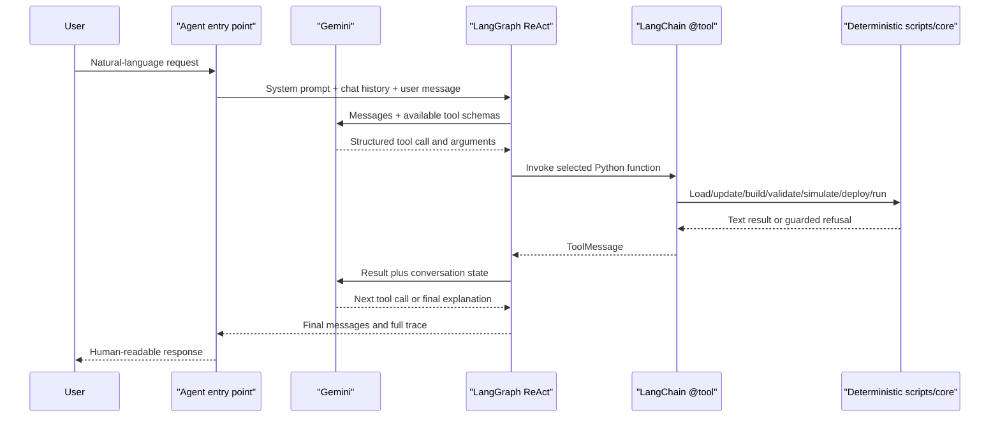

# OT-2 Lab Suite Architecture — LLM Context Guide

This document is a source-audited architecture map of the repository. It is
written so that another LLM can understand the project before proposing changes
or choosing commands.

If a narrative document conflicts with executable source, use this precedence:

1. `AGENTS.md` for laptop-role and live-run safety;
2. current Python source and current YAML configuration;
3. tests that assert the current behavior;
4. `skills/` and other explanatory documentation.

The final point matters because some older documentation still describes an
earlier single-tip printing design. The current vial workflow uses one active
nozzle for vial-to-well setup, then all eight nozzles for column mixing and paper
printing. It also supports separate orange and blue series.

## 1. The shortest accurate mental model

The repository has two automation layers over the same laboratory operations:

1. **Digital automation** — deterministic Python scripts, YAML configs, Opentrons
   protocols, validators, camera/CV utilities, and robot transport code.
2. **Intelligent automation** — Gemini-powered LangGraph agents that translate a
   natural-language request into structured calls to those deterministic Python
   operations.

The AI layer is an orchestration front end. It does not replace the protocol,
builder, simulator, validator, HTTP runner, or SSH/SCP transport.

```mermaid
flowchart LR
    U1["Human using CLI"] --> D["Deterministic Python functions and scripts"]
    U2["Human using natural language"] --> L["Gemini chat model"]
    L --> G["LangGraph ReAct loop"]
    G --> T["LangChain tool functions"]
    T --> D

    D --> C["YAML configs and constraints"]
    C --> B["Builders and protocol generators"]
    B --> P["Self-contained generated OT-2 protocol"]
    P --> S["Local simulation and validation gates"]
    S -->|"low API / legacy path"| X["SSH + SCP + opentrons_execute"]
    S -->|"new protocol engine path"| H["OT-2 HTTP API: upload, create run, play, monitor"]
    H --> R["Physical OT-2"]
    X --> R
    R --> I["Camera images"]
    I --> V["Offline OpenCV quality analysis"]
```



## 2. The two-laptop boundary

This boundary is part of the architecture, not an operator preference.

| Laptop role | Conda environment | Allowed work | LLM authentication |
|---|---|---|---|
| Home/simulation laptop | `ai` | Edit, build, simulate, validate, run tests, inspect generated protocols, and analyze local images | Gemini API key is permitted for agent testing: `LLM_PROVIDER=api-key` plus `GOOGLE_API_KEY` |
| Real-robot laptop | `llm` | The same local work, plus explicitly confirmed live OT-2 operations | Vertex AI with gcloud Application Default Credentials: `LLM_PROVIDER=vertexai`, `GOOGLE_CLOUD_PROJECT`, and `GOOGLE_CLOUD_LOCATION` |

The home laptop must never run a live robot command, an HTTP runner with
`--live`, or anything that starts liquid-handling motion. A live run on the real
laptop additionally requires a physical-readiness review and explicit user
confirmation.

## 3. Repository map

| Path | Architectural responsibility |
|---|---|
| `AGENTS.md` | Machine-role rules and the top-level live-run boundary |
| `configs/workflows/defaults/` | Committed default experiment plans in YAML |
| `configs/workflows/user/` | Timestamped, run-specific YAML copies created by agents or operators |
| `configs/workflows/templates/` | Reusable named workflow plans, especially for vial printing |
| `configs/constraints/` | Deck, pipette, labware, and workflow validation rules for the generic workflow system |
| `configs/labware/` | Parametric YAML inputs for custom labware generation |
| `configs/vision.yaml` | Configuration for the older image acquisition/inventory workflow |
| `labware/` | Generated Opentrons schema-v2 custom labware JSON definitions |
| `src/core/` | Central environment config, Pydantic models, constraint loading, validation, and workflow registry |
| `src/protocols/` | OT-2 protocol templates and generic Python protocol generators |
| `src/protocols/generated/` | Generated robot-ready Python artifacts; do not edit these directly |
| `scripts/` | Deterministic builders, validators, robot runners, deploy/sync, camera, and labware utilities |
| `src/agents/` | LangGraph agent entry points and LangChain tool definitions |
| `skills/` | Human/LLM playbooks: procedures, parameter dictionaries, safety constraints, and command references |
| `robot_data/` | Local robot-data mirror, simulation records, logs, outputs, and deploy staging |
| `vision/` | Image acquisition, transfer, inventory, and basic image validation |
| `vision_tests/` | Offline droplet detection and grid-aware print-quality analysis |
| `tests/` | Unit, regression, safety, dependency, agent, and HTTP-tool tests |

---

# Part I — Digital automation

## 4. Configuration architecture

### 4.1 Central environment configuration

`src/core/config.py` loads the root `.env` and exposes a `Config` class. Important
settings include:

| Setting | Meaning |
|---|---|
| `ROBOT_IP` | Robot network address; source fallback is `127.0.0.1` |
| `ROBOT_SSH_USER` | Robot SSH account, normally `root` |
| `ROBOT_SSH_KEY_PATH` | Private key used for non-interactive SSH/SCP |
| `ROBOT_SSH_IDENTITIES_ONLY` | Restrict SSH to the configured identity; defaults to `true` |
| `ROBOT_SSH_LEGACY_RSA` | Add OT-2-scoped `ssh-rsa` user-authentication compatibility when `true` |
| `ROBOT_REMOTE_RUN_DIR` | Base robot directory exposed as `Config.REMOTE_USER_STORAGE` |
| `OT_API_CONFIG_DIR` | Local Opentrons API data/config mirror; defaults inside `robot_data/data/` |
| `LLM_PROVIDER` | `api-key` or `vertexai` |
| `GEMINI_MODEL` | Gemini model selected by environment; source fallback is `gemini-1.5-flash` |
| `GOOGLE_CLOUD_PROJECT` and `GOOGLE_CLOUD_LOCATION` | Vertex AI project and region |
| `GOOGLE_API_KEY` | Simulation-laptop Gemini API-key path only |

The module also adds the robot IP to `NO_PROXY` so local robot traffic does not
accidentally travel through a corporate proxy.

All repository paths are derived from `PROJECT_ROOT` in `src/utils/paths.py`.
Shared code should use `pathlib.Path` for local paths. Robot paths must remain
POSIX strings or `PurePosixPath` values because the OT-2 runs Linux.

### 4.2 Generic workflow configuration

The generic system supports this data flow:

```text
default YAML
  -> in-memory working dictionary
  -> recursive user updates
  -> Pydantic schema validation
  -> constraint validation
  -> typed workflow object
  -> Python protocol generator
  -> generated_<workflow>.py
```

Main components:

- `src/core/config_loader.py` loads defaults, deep-merges updates, validates, and
  can save run-specific YAML.
- `src/core/models/config_models.py` defines typed Pydantic models for dilution
  and printing workflows.
- `src/core/constraints_manager.py` loads the YAML constraint files once.
- `src/core/validation/workflow_validator.py` checks labware identity and
  compatibility, deck slots, duplicate slots, well capacity, pipette volume and
  mount, split-transfer policy, and whether robot connection is permitted.
- `src/core/workflows/registry.py` maps a workflow name to its schema, default
  YAML, protocol generator, and description.

Current registry status:

| Registry key | Current status |
|---|---|
| `dilution` | Registered, Pydantic-modeled, constraint-validated, and generated |
| `printing` | Registered, Pydantic-modeled, constraint-validated, and generated |
| `printing_demo` | Registered with its own Pydantic model/generator, but the shared constraint validator only recognizes `dilution` and `printing` |
| `austar` | Registered placeholder; generator raises `NotImplementedError` |
| `cleanup` | Registered placeholder; generator raises `NotImplementedError` |

The files `printing_12.yaml` and `printing_96.yaml` exist as configs but are not
separate entries in the current Python registry.

### 4.3 Hardened, workflow-specific configuration

The flagship vial-dilution-print workflow intentionally does not use the generic
registry renderer. Its source of truth is:

`configs/workflows/defaults/vial_dilution_print.yaml`

That YAML defines:

- deck slots and exact labware identities;
- the fixed `p300_multi_gen2` on the right mount;
- water, orange dye, and blue dye vial positions;
- dilution factors and per-well volume;
- one-tip setup-tip allocation;
- orange and blue destination columns;
- full eight-tip printing columns and paper locations;
- droplet volume, air gap, speed, height, dwell, blow-out, and replicates;
- camera capture timing and robot image directory;
- host-side CV expectations;
- physical geometry and volume safety expectations;
- runtime modes such as dry run, dilution on/off, and print on/off.

The agent loads this into memory, modifies a copy, and writes a timestamped YAML
under `configs/workflows/user/`. The committed default is not modified during a
conversation.

## 5. Protocol architecture

There are two main ways a robot protocol is created.

### 5.1 Generic generator path

For `dilution` and `printing`:

1. Pydantic converts the nested YAML model into a base dictionary.
2. `src/protocols/dilution.py` or `src/protocols/printing.py` renders a standalone
   Python source string.
3. The general agent writes it to
   `src/protocols/generated/generated_<workflow>.py`.
4. The exact file is hashed with SHA-256.

These generated protocols use low API levels (`2.13` or `2.15`) and a relatively
simple transfer implementation. They are architectural examples and generic
automation paths; the vial-print protocol is much more extensively guarded.

### 5.2 Build-and-embed path

The vial-print and plate-waste workflows use a compiler-like builder:

```text
YAML
  -> builder-side validation
  -> read base protocol template
  -> replace CONFIG between sentinel comments
  -> replace default runtime-mode constants
  -> write timestamped artifact plus *_latest.py
  -> simulate the generated artifact
```

For vial printing, `scripts/build_vial_dilution_print.py`:

1. Loads a chosen YAML file.
2. Removes `run_modes` from the dictionary that will become `CONFIG`.
3. Validates factor count, volumes, labware capacity, pipette capacity, deck and
   tip allocation, paper sweep, and related invariants.
4. Rewrites `DEFAULT_DRY_RUN`, `DEFAULT_DO_DILUTION`, and `DEFAULT_DO_PRINT`.
5. Replaces the region between `# >>> CONFIG START >>>` and
   `# <<< CONFIG END <<<` in `src/protocols/printing/01_vial_dilution_paper_print.py`.
6. Writes a timestamped artifact and
   `src/protocols/generated/vial_dilution_print_latest.py`.
7. Simulates the timestamped artifact with the repository's custom labware.
8. Requires both a zero process status and no recognized error markers in the
   simulator text before printing `SIMULATION OK`.

Embedding is required because the robot receives a Python protocol file, not the
repository and its YAML files. The generated Python file must therefore be
self-contained. Edit the YAML or base template, never `*_latest.py` directly.

### 5.3 What the current vial protocol does on the robot

`src/protocols/printing/01_vial_dilution_paper_print.py` uses Opentrons API `2.28` and executes this
logic:

1. Load the exact vial rack, dilution plate, paper-coordinate plate, tip rack,
   and right-mounted `p300_multi_gen2`.
2. Derive rows and columns from loaded labware rather than assuming literals.
3. Resolve orange/blue series, wells, factors, tips, and paper columns.
4. Run an on-robot preflight before motion. It checks deck uniqueness, rack
   identity and geometry, source wells, plate/paper well counts, pipette and mount,
   factors, capacities, tip separation, print sweep, and camera row names.
5. In one-nozzle `SINGLE` mode, use one dedicated water tip to add water to both
   color series.
6. Still in `SINGLE` mode, use a separate setup tip per color to add stock dye.
7. Switch to `ALL` nozzle mode, pick a full eight-tip column for each color, mix
   the eight wells together as a column, and print eight droplets simultaneously.
8. Repeat the paper print at configured X/Y/Z offsets.
9. Return or drop tips according to config; the default returns them.
10. When not simulating, call the robot-local camera HTTP endpoint with `curl` and
    store JPEG files under `/data/vision/vial_dilution_print`.

Runtime parameters allow a dry run, dilution-only, print-only, and paper start
column override without rebuilding the base experiment plan.

## 6. Validation, simulation, and traceability

### 6.1 Generic validation

The general workflow validator combines:

- Pydantic structure and type checks;
- YAML-defined deck, labware, pipette, and workflow constraints;
- errors for invalid slots, unsupported labware, volume overflow, invalid mount,
  or disallowed robot connection;
- warnings for values above recommended working volumes or split transfers.

### 6.2 Exact-artifact simulation records

`simulate_protocol()` computes SHA-256 for the protocol and writes a record to:

`robot_data/data/simulations.json`

The record contains the path, timestamp, status, and simulator output. The
generic SSH execution tool and the specialized HTTP tool require a `PASS` record
for the exact current SHA-256. Editing the protocol changes the hash and invalidates
the earlier approval.

### 6.3 Vial run-mode matrix

`scripts/validate_vial_print.py` does not trust the simulator's exit code alone.
It renders and simulates five cases, then scans the actual output:

| Case | Expected behavior |
|---|---|
| `full_run` | Preflight, dilution, eight-channel mixing, paper printing, tip return, completion |
| `dry_run` | Preflight and comments only; no liquid operations |
| `dilution_only` | Dilution and mixing, no paper printing |
| `print_only` | Paper printing, no dilution |
| `wrong_labware` | Deliberately altered rack identity must trigger preflight failure before completion |

Only `ALL CASES PASSED` is an acceptable matrix result.

### 6.4 Tests

The `tests/` directory includes:

- config and constraint validation tests;
- protocol and builder invariant tests;
- vial agent and tool tests;
- HTTP safety-gate tests;
- robot-automation tests using mocks;
- print-quality/CV tests;
- dependency-hygiene checks that forbid legacy `langchain.agents` imports and
  preserve `langgraph.prebuilt.create_react_agent`.

## 7. Robot transport architecture

The repository contains both SSH-based and HTTP-based execution because they
serve different Opentrons protocol-engine requirements.

### 7.1 Transport selection rule

| Protocol type | Preferred transport | Why |
|---|---|---|
| Low API level, approximately `2.13`–`2.15`, without partial-nozzle features | SSH/SCP followed by `opentrons_execute` can be used | Legacy execution does not require the new deck-configuration object |
| API `2.16+`, especially `2.28` with `configure_nozzle_layout()` and partial-tip `return_tip()` | Robot HTTP API / Opentrons App execution | The new protocol engine requires deck configuration that bare `opentrons_execute` does not supply |

The current vial-print and plate-waste protocols use API `2.28`, so their live
runners use the HTTP API. Running them through bare `opentrons_execute` can cause
`AreaNotInDeckConfigurationError` even when the deck slots are correct.

### 7.2 SSH and SCP mechanics

Current guarded SSH/SCP code uses:

- the shared `src/utils/ot2_ssh.py` command builder;
- the explicit private key from `ROBOT_SSH_KEY_PATH` via `-i`;
- `IdentitiesOnly=yes`;
- `PubkeyAcceptedAlgorithms=+ssh-rsa` only when `ROBOT_SSH_LEGACY_RSA=true`;
- `BatchMode=yes`, which prevents password prompts inside automation;
- a finite `ConnectTimeout`;
- POSIX robot paths;
- `scp -O`, which forces the legacy SCP protocol supported by the OT-2's SSH
  server.

Conceptually, the manual low-API sequence is:

```powershell
$IP = "169.254.46.57"
$KEY = "$env:USERPROFILE\.ssh\id_rsa_opentrons"
$REMOTE = "/var/lib/opentrons/user_storage/ot2_runs"
$OPTS = @(
    "-o", "IdentitiesOnly=yes",
    "-o", "PubkeyAcceptedAlgorithms=+ssh-rsa",
    "-i", $KEY,
    "-o", "BatchMode=yes",
    "-o", "ConnectTimeout=10"
)

ssh @OPTS root@$IP "mkdir -p $REMOTE"
scp -O @OPTS "src/protocols/generated/generated_dilution.py" "root@${IP}:$REMOTE/generated_dilution.py"
ssh @OPTS root@$IP "ls -lah $REMOTE/generated_dilution.py"
ssh @OPTS root@$IP "opentrons_execute $REMOTE/generated_dilution.py"
```

Those are real-robot-laptop operations only. They are shown here to explain the
transport, not to authorize a live run.

The general agent's SSH deployment path:

1. stages the protocol, optional configs, and a JSON manifest under
   `robot_data/deploy/run_<timestamp>/`;
2. creates a matching robot directory;
3. uses `scp -O -r` to copy the staged run;
4. verifies that the requested SHA-256 has a passing simulation record;
5. invokes `opentrons_execute` through SSH.

SSH is also used independently of execution to inspect attached-instrument JSON,
check calibration files, create/clean camera directories, and verify files.
Host-key checking remains enabled. See
[OT-2 SSH compatibility](OT2_SSH_COMPATIBILITY.md) for configuration,
diagnostics, and host-key-change handling.

### 7.3 Custom labware deployment

`python -m scripts.deploy --labware <definition.json>` reads `namespace`,
`parameters.loadName`, and `version` from the JSON. It creates and verifies:

```text
/data/labware/v2/custom_definitions/<namespace>/<loadName>/<version>.json
```

This is the custom-labware store used by headless `opentrons_execute`. Labware
used by the Opentrons App may also need to be imported into the App's store.

### 7.4 HTTP API mechanics

`scripts/run_vial_print_robot.py` communicates with the robot server at port
`31950` and sends the `opentrons-version: *` header:

1. optionally build and locally validate;
2. `POST /protocols` with the generated Python file;
3. obtain a protocol ID;
4. `POST /runs` with the protocol ID and runtime parameter values;
5. obtain a run ID;
6. unless `--no-start`, `POST /runs/<run_id>/actions` with `actionType=play`;
7. poll `GET /runs/<run_id>` until `succeeded`, `failed`, or `stopped`;
8. write a local run log;
9. after a live run, pull camera images to a timestamped local folder.

The default is a dry run. `--live` changes `dry_run` to false and permits liquid
motion, so it is allowed only on the real robot laptop after explicit readiness
confirmation.

The reusable pattern lives in `scripts/run_robot_template.py`. Other examples
are `run_plate_waste_disposal.py`, `run_droplet_error_check.py`, and
`run_3d_print_labware_validate.py`.

### 7.5 Why the vial agent uses `--skip-build --skip-validate`

The specialized agent has already created a timestamped user YAML, embedded that
exact plan, simulated it, and run its matrix. Its HTTP tool therefore launches:

```text
scripts/run_vial_print_robot.py --skip-build --skip-validate ...
```

This prevents the runner from silently rebuilding from the committed default and
uploading a different experiment. The tool still checks the exact generated
protocol hash against the PASS simulation record before launching it.

On the manually synchronized real laptop, these skip flags are safe only when the
generated `vial_dilution_print_latest.py` was rebuilt, reviewed, committed,
pushed, and pulled there together with its intended source changes.

## 8. Camera and computer-vision path

### 8.1 Image acquisition and transfer

The vial protocol calls the robot-local camera endpoint and writes files to
`/data/vision/vial_dilution_print`. The HTTP runner can clear old images before a
run and then uses `scp -O -r` to pull the run's images into:

`vision_runs/vial_dilution_print/run_<timestamp>/`

Related utilities include:

- `scripts/pull_vision_images.py` for a direct timestamped folder pull;
- `scripts/test_ot2_camera_capture.py` for SSH → camera `curl` → SCP → image
  validation diagnostics;
- `scripts/pull_ot2_images.py` and `vision/` for the larger image-transfer,
  inventory, and validation workflow.

### 8.2 Two CV analysis paths

1. `vision_tests/scripts/verify_print_droplets.py` is the older contour-based
   count/shape/color-gradient verifier. The vial agent currently calls its
   synthetic `--mock` mode as a no-camera pipeline sanity test.
2. `vision_tests/scripts/analyze_print_quality.py` plus
   `vision_tests/print_quality.py` is the grid-aware real-image workflow. It
   measures every expected lattice position, which is more appropriate for very
   pale droplets and missing-drop checks.

The grid-aware analysis reports per position:

- present, borderline, not detected, or unassessable;
- relative color and color reliability;
- area, diameter, circularity, aspect ratio, and round/blob classification when
  resolution supports it;
- center-versus-edge coffee-ring ratios and reliability;
- potentially missing rows within every expected eight-drop column.

It creates JSON, CSV, annotated images, crop montages, per-column summaries, and
multi-frame repeatability summaries. It is offline and never controls the robot.

---

# Part II — Intelligent automation

## 9. LLM and LangGraph architecture

The AI stack is:

- **Gemini chat model** — either `ChatGoogleGenerativeAI` with an API key or
  `ChatVertexAI` with gcloud ADC;
- **LangChain `@tool` functions** — typed Python functions whose signatures and
  docstrings become tool schemas visible to the model;
- **LangGraph `create_react_agent`** — the supported ReAct/tool-calling loop;
- **deterministic repository code** — the actual side effects and safety checks.

There is no vector database, embedding index, or RAG subsystem in the current
agent runtime. The model receives a system prompt, chat history, and tool schemas.
Repository `skills/` files are documentation/governance and are not dynamically
retrieved by the LangGraph agent.

### 9.1 What happens on each natural-language turn



The LLM decides which exposed tool to request next. Python decides what actually
happens. A tool can refuse an unsafe request even if the LLM asks for it.

### 9.2 State and memory

- The general tools keep `_WORKING_CONFIG` and `_CURRENT_WORKFLOW` as module-level
  in-process state.
- The vial tools keep their own in-process working config, default factors,
  latest user YAML, and latest hash.
- The REPL sends recent chat messages back to the graph. The vial agent sanitizes
  and bounds its retained history.
- This is session memory, not durable semantic memory. Restarting the process
  clears the in-memory working state, although YAMLs, generated files, simulation
  records, templates, and logs remain on disk.

## 10. General OT-2 agent

Entry point:

```text
python -m src.agents.main
```

`src/agents/main.py` constructs one LangGraph ReAct agent with 18 registered
tools: 12 generic workflow/robot tools and 6 labware tools.

### 10.1 Generic workflow and robot tools exposed by `main.py`

| Tool | Deterministic responsibility |
|---|---|
| `list_available_workflows` | Read the Python workflow registry |
| `load_workflow_defaults` | Load a workflow YAML into in-memory state |
| `update_workflow_config` | Deep-merge structured updates |
| `validate_current_workflow` | Run shared Pydantic and constraint validation |
| `validate_config` | Validate an arbitrary YAML path |
| `show_full_config` | Return the active YAML-like dictionary for review |
| `generate_protocol` | Generate a Python protocol and return its SHA-256 |
| `simulate_protocol` | Run local Opentrons simulation and record PASS/FAIL by hash |
| `get_robot_hardware_status` | Read attached-instrument data over SSH |
| `check_robot_connection` | Check SSH BatchMode and `opentrons_execute` |
| `deploy_protocol_to_robot` | Stage a manifest and copy files with SSH/SCP |
| `execute_protocol_on_robot` | Enforce the simulation-hash gate, then call `opentrons_execute` |

`src/agents/tools.py` also defines `deploy_and_run_on_robot`, but the current
general agent does not register that wrapper as an available tool.

At generation time, the tool re-reads the pipette block from committed defaults
instead of trusting a model-supplied pipette change. This is an anti-hallucination
safety measure.

### 10.2 Labware tools exposed by `main.py`

| Tool | Deterministic responsibility |
|---|---|
| `list_labware_configs` | List YAML definitions under `configs/labware/` |
| `list_generated_labware` | List generated JSON files under `labware/` |
| `list_labware_presets` | Show supported grid/reservoir/tube-rack starting layouts |
| `describe_labware_config` | Summarize a YAML specification |
| `create_labware_config` | Create a validated YAML spec from preset plus overrides |
| `generate_labware_from_config` | Call the schema-v2 generator and write Opentrons JSON |

### 10.3 General-agent pipeline

Its system prompt directs the model to:

```text
identify workflow
  -> load defaults
  -> apply updates
  -> validate
  -> generate
  -> simulate exact artifact
  -> inspect robot/hardware only when a physical run is requested
  -> present pre-run summary
  -> require exact RUN ROBOT confirmation
  -> deploy
  -> execute
```

The robot tools themselves also enforce Vertex authentication for live agent
interactions and require a passing simulation record.

## 11. Specialized vial-print agent

Entry point:

```text
python -m src.agents.vial_print_agent
```

This agent exists because the flagship workflow has a stronger build/validate/CV
pipeline than the generic registry.

### 11.1 Simulation-only tool set: 10 tools

| Tool | Role |
|---|---|
| `load_vial_print_defaults` | Load the committed default into a working copy |
| `list_vial_print_templates` | List reusable named YAML plans |
| `save_vial_print_template` | Save the working plan under `configs/workflows/templates/` |
| `load_vial_print_template` | Restore a named plan into working state |
| `update_vial_print_params` | Map structured parameters into the YAML copy |
| `preview_dilution_plan` | Resolve folds, stock/water volumes, columns, and paper positions |
| `show_vial_print_config` | Display the complete active config |
| `build_vial_print_protocol` | Write user YAML, call the builder, simulate, hash, and record PASS |
| `validate_vial_print_matrix` | Call the five-case validator using that same user YAML |
| `verify_print_droplets_mock` | Run the synthetic no-camera CV count sanity check |

With `--simulation-only`, these are the only tools given to the model, so it
cannot even request a hardware check or robot run.

### 11.2 Robot-capable additions: 4 tools

| Tool | Role |
|---|---|
| `list_robot_http_protocols` | Describe the protocol runner registry |
| `get_robot_hardware_status` | Verify the attached pipette over SSH |
| `check_robot_http_api` | Query `http://<robot>:31950/health` |
| `run_vial_print_robot_http` | Enforce confirmation/auth/hash gates and launch the HTTP runner |

The complete robot-capable vial agent therefore has 14 tools.

### 11.3 Natural-language mapping

Examples of how language becomes structured config:

| User phrase | Tool argument | YAML effect |
|---|---|---|
| “Use 5 dilutions” | `num_dilutions=5` | Keep the first five canonical factors and set `cv.expected_droplets=5` |
| “Print 20 microliter drops” | `droplet_volume_ul=20` | Set `printing.droplet_volume_ul` |
| “Make 3 replicates” | `num_replicates=3` | Update replicate counts for the configured color series |
| “Start orange on paper column 2” | structured/advanced update | Change the applicable `color_series` paper start column |
| “Use total volume 180 µL” | `advanced_updates={...}` | Deep-update the documented nested YAML key |

After interpretation, the deterministic builder and preflight still enforce the
actual bounds. Natural language does not grant the model permission to invent an
unsupported key or bypass a validator.

### 11.4 Mandatory specialized-agent sequence

The system prompt requires literal successful tool results in this order:

```text
load defaults
  -> update parameters
  -> preview dilution math
  -> build and require “SIMULATION OK”
  -> matrix and require “ALL CASES PASSED”
  -> mock CV and require “CV PASS”
```

For a physical run it then requires:

```text
Vertex/gcloud authentication
  -> actual hardware check
  -> HTTP health check
  -> detailed pre-run summary
  -> user replies exactly RUN ROBOT
  -> HTTP run tool with confirmation="RUN ROBOT"
```

The run tool independently refuses if:

- confirmation is not exactly `RUN ROBOT`;
- the LLM provider is not authorized for live operation;
- the IP is blank or local host;
- the runner or generated protocol is missing;
- the current protocol SHA-256 lacks a PASS simulation record.

### 11.5 No-LLM deterministic mode

`python -m src.agents.vial_print_agent --no-llm "..."` uses regular expressions
to parse common knobs and directly runs load → update → preview → build → matrix
→ mock CV. It is useful for offline verification and CI because it needs no model
credential. It is still digital automation even though it shares the agent entry
module.

## 12. Robot protocol registry

`src/agents/robot_protocol_registry.py` describes live runner availability:

| Key | Runner transport | Agent exposure |
|---|---|---|
| `vial_dilution_print` | HTTP API | Enabled for the specialized vial agent |
| `droplet_error_check` | HTTP API plus SCP image pull | Manual only |
| `plate_waste_disposal` | HTTP API | Manual only |

This registry prevents the AI agent from treating every Python protocol in the
repository as automatically authorized for natural-language live launch.

## 13. Skills versus tools

The terms are related but not interchangeable.

### Skills

Files under `skills/` are playbooks for humans and coding agents. They document:

- when a capability should be used;
- the canonical files and commands;
- safe parameter ranges and units;
- required gates and invariants;
- the split between simulation and real hardware;
- known robot-specific constraints.

Main skill packages:

| Skill | Knowledge area |
|---|---|
| `ot2-protocols` | Workflow config, generation, validation, simulation, and SHA traceability |
| `ot2-labware` | Parametric YAML-to-JSON labware generation and naming/geometry rules |
| `ot2-robot-control` | Live connectivity, SSH/SCP, custom labware, execution, and failure diagnosis |
| `ot2-robot-profile` | This OT-2's pipette, mount, software/API constraints, deck rules, and custom labware |
| `vial-dilution-print` | Flagship workflow parameters, mechanics, builder, matrix, CV, and tests |

`AI_AGENTS_SKILLS_OVERVIEW.md` is the repository governance entry point. It tells
coding agents to read the relevant skill, keep every value within documented
bounds, preserve testable invariants, edit YAML rather than generated protocols,
and update documentation when behavior changes.

### Tools

Functions decorated with LangChain `@tool` are runtime capabilities callable by
the LangGraph agent. Their signatures and docstrings become JSON-like schemas for
the model. Tools load files, update state, generate artifacts, execute scripts,
perform network checks, or return guarded refusals.

In short:

```text
skill = knowledge and operating policy
tool  = callable Python capability
agent = LLM + prompt + conversation + selected tool set + orchestration loop
```

The current runtime does not automatically read `skills/` before each tool call.
Safety-critical behavior must therefore also exist in Python validation, tool
guards, protocol preflight, tests, and operator procedure—not only in prose.

## 14. How intelligent automation reproduces digital automation

| Laboratory goal | Manual digital path | Intelligent path |
|---|---|---|
| Choose a workflow | Inspect config/registry | LLM calls `list_available_workflows` |
| Start an experiment plan | Open/copy YAML | LLM calls a defaults/template loader |
| Change parameters | Edit YAML | LLM extracts intent and calls an update tool with typed values |
| Check safety | Run validator | LLM calls validator; Python returns exact failures |
| Build protocol | Run builder/generator | LLM calls build/generate tool, which invokes the same code |
| Simulate | Run `opentrons.simulate` or builder | LLM calls simulation/build tool; exact hash is recorded |
| Validate modes | Run matrix script | Vial LLM calls the matrix wrapper |
| Check CV pipeline | Run CV CLI | Vial LLM calls the mock verifier wrapper |
| Check robot | Run SSH/HTTP diagnostic | LLM calls guarded connection/hardware tools |
| Deploy low-API protocol | Run SSH/SCP | General agent calls staging and deploy tools |
| Run low-API protocol | Run `opentrons_execute` over SSH | General agent calls hash-gated execute tool |
| Run vial protocol | Run HTTP runner | Specialized agent calls the HTTP wrapper after `RUN ROBOT` |
| Create custom labware | Edit YAML and run generator | General agent calls preset/config/generator tools |

The value of the AI layer is intent translation and orchestration. The safety and
reproducibility come from deterministic enforcement underneath it.

## 15. Logging and audit trail

The system leaves several forms of evidence:

- timestamped user YAMLs for specialized vial-agent plans;
- reusable named templates when explicitly saved;
- generated timestamped protocols and `*_latest.py` artifacts;
- SHA-256 simulation records;
- local deploy manifests for generic SSH staging;
- robot runner logs under the robot-data logging structure;
- general-agent and vial-agent session logs under
  `robot_data/data/logs/agents/`;
- CV JSON/CSV plus annotated images and montages;
- full LangGraph result traces in agent session logs.

These artifacts let an operator answer: what was requested, what configuration
was used, what exact Python file was simulated, whether the same hash was
launched, what the robot reported, and what the camera/CV observed.

## 16. Main deterministic scripts

| Script | Purpose |
|---|---|
| `build_vial_dilution_print.py` | Validate vial YAML, embed config, generate artifacts, and simulate |
| `validate_vial_print.py` | Five-case output-scanning validation matrix |
| `run_vial_print_robot.py` | HTTP upload/create/play/monitor plus camera folder management and SCP pull |
| `build_plate_waste_disposal.py` | Embed waste YAML and simulate generated disposal protocol |
| `run_plate_waste_disposal.py` | HTTP runner for plate-to-waste disposal |
| `run_droplet_error_check.py` | HTTP paper-print diagnostic plus SCP before/after image pull |
| `run_robot_template.py` | Starting pattern for new HTTP runners |
| `run_3d_print_labware_validate.py` | HTTP runner for physical labware validation protocol |
| `check_connectivity.py` | Environment, network, SSH, and calibration diagnostics |
| `deploy.py` | Bulk SSH/SCP staging deploy or one custom labware JSON deploy |
| `run_smoke_test.py` | P20 local simulation by default; explicit HTTP API dry-motion runner |
| `generate_labware.py` | Parametric YAML-to-Opentrons-JSON generator |
| `pull_vision_images.py` | Direct guarded SCP pull of a robot vision folder |
| `pull_ot2_images.py` | Config-driven transfer, inventory, and validation workflow |
| `test_ot2_camera_capture.py` | Camera endpoint and image-transfer diagnostic; also has mock mode |
| `validate_vial_print.py` | Active Workflow 01 five-mode output-scanning simulation validator; use with `build_vial_dilution_print.py` |
| `audit_paths.py` | Detect problematic hardcoded paths and portability issues |
| `sync_robot.py` | Broad robot-data pull using the shared SSH settings and `scp -O` |

## 17. Current implementation caveats an LLM must know

1. **Use current source over stale descriptions.** The live vial code is dual
   color and uses full eight-channel paper printing after one-tip setup.
2. **The general and vial agents are distinct.** The general registry path is not
   a substitute for the specialized vial build/matrix/CV path.
3. **The vial workflow must use the HTTP runner.** Do not route its API-2.28
   protocol through the general SSH `opentrons_execute` tools.
4. **The general agent registers 18 tools.** Older docs that call it a 12-tool
   agent count only the generic group and omit the six labware tools.
5. **The specialized vial agent has 10 simulation tools and 14 robot-capable
   tools.** Older lists may omit template and HTTP-registry additions.
6. **The source model fallback differs from the environment template.**
   `Config` falls back to `gemini-1.5-flash`; `.env.template` suggests
   `gemini-2.5-flash`. The actual `.env` wins.
7. **No RAG or automatic skill loading exists.** Skills inform development and
   operation but are not runtime retrieval sources for the LangGraph process.
8. **The generic `--mock` branch is currently incomplete.** `main.py` references
   `MockToolCallingLLM` without defining/importing it. Use real configured LLM
   mode for that entry point or the vial agent's deterministic `--no-llm` path.
9. **The generic remote-directory code is inconsistent.** `Config` defaults
   `ROBOT_REMOTE_RUN_DIR` to a path already ending in `ot2_runs`, while the
   generic deploy tool appends another `ot2_runs`. Inspect the resolved remote
   path before relying on that path in a live generic-agent run.
10. **`sync_robot.py` is older than the guarded transfer pattern.** Prefer the
    newer deploy/pull scripts that explicitly use the OT-2 key, BatchMode, and
    `scp -O`.
11. **A simulator process return code is not enough.** For the hardened workflows,
    trust `SIMULATION OK`, `ALL CASES PASSED`, and their output scans.
12. **The real-image CV workflow is not yet the vial agent's final hardware gate.**
    The agent currently calls mock CV; captured images are analyzed separately by
    the grid-aware offline CLI.

## 18. Compact operating instructions for another LLM

Use the following as a short prompt after this guide has been loaded:

> You are working in an OT-2 hardware-in-the-loop repository with two layers:
> deterministic digital automation and a natural-language LangGraph front end.
> First identify the laptop role. On the home laptop, use conda `ai` and perform
> only local editing, build, simulation, validation, tests, generated-protocol
> inspection, and offline CV. Never start robot motion. On the real laptop, use
> conda `llm`; live AI interactions require Vertex AI/gcloud ADC and explicit
> physical readiness plus exact `RUN ROBOT` confirmation. Treat YAML as the
> experiment source of truth and never edit generated protocols. For the vial
> workflow, use its specialized builder, five-case validator, mock-CV check, and
> API-2.28 HTTP runner; do not use bare `opentrons_execute`. For low-API generic
> workflows, the SSH/SCP path may be used, but require the explicit OT-2 key,
> BatchMode, `scp -O`, and an exact SHA-256 PASS simulation record. The LLM may
> choose tools, but deterministic Python validation, protocol preflight, tool
> guards, tests, and operator confirmation remain authoritative.

