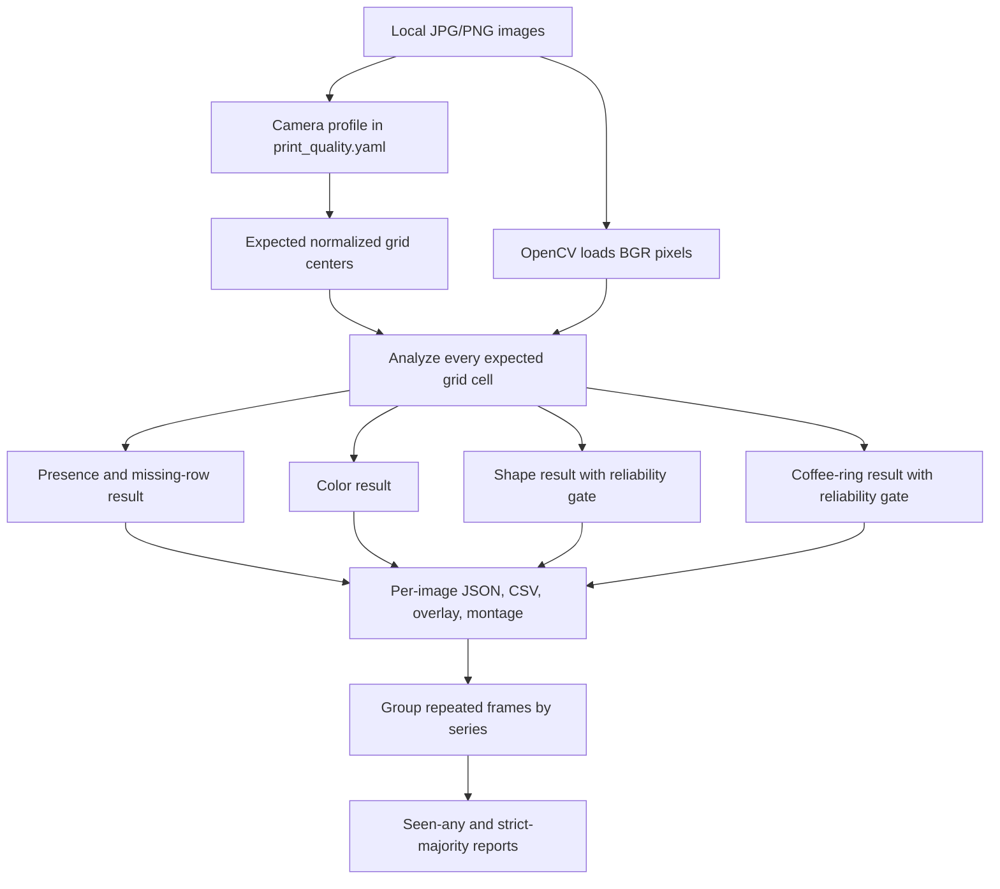

# Study guide: printed-droplet computer vision

## 1. One-sentence description

The module uses the known print grid to examine every expected droplet location,
compare it with nearby paper, and report presence, color, shape, coffee-ring
behavior, missing positions, and repeatability across several photographs.

## 2. The most important idea

This is **grid-aware classical computer vision**, not a trained AI model.

A generic blob detector looks for visible colored objects and counts whatever it
finds. That approach tends to miss dilute droplets because the faintest dots may
not create obvious closed contours. Our module starts with a stronger piece of
experimental knowledge: the robot intended to print a regular grid, normally
with 8 dilution rows in every column.

The module therefore asks:

> At each position where a droplet is expected, is there enough local evidence
> to call it detected, borderline, not detected, or unassessable?

That distinction is why the module can identify an exact missing row such as
`column 2, row 5`, rather than only reporting a total blob count.

## 3. Safety boundary

The computer-vision workflow is offline. It:

- reads existing JPG or PNG files;
- performs calculations in memory;
- writes local JSON, CSV, and annotated images; and
- never connects to the OT-2 or starts robot motion.

On the home/simulation laptop, use the `ai` conda environment. On the real-robot
laptop, use the `llm` environment, but the commands in this guide still analyze
only already-captured local images.

## 4. What the module is designed to answer

For every expected droplet position, it tries to answer five questions:

1. **Count:** Was a droplet detected at the expected position?
2. **Color:** What broad color family is visible?
3. **Shape:** Is the footprint round or blob/irregular?
4. **Coffee ring:** Is dye more concentrated near the outer edge than the center?
5. **Missing print check:** Which of the 8 expected rows in each column were not
   confidently detected?

It also asks a sixth question when multiple photos show the same print:

6. **Repeatability:** Was each position detected in any frame and in a strict
   majority of frames?

## 5. File map

| File or folder | Purpose |
|---|---|
| `vision_tests/print_quality.py` | Core image-analysis algorithms and measurements |
| `vision_tests/scripts/analyze_print_quality.py` | Command-line runner, report writer, and multi-frame aggregation |
| `vision_tests/configs/print_quality.yaml` | Camera profiles, grid calibration, thresholds, and benchmark image definitions |
| `vision_tests/configs/blue_orange_camera_comparison.yaml` | Reproducible same-print OT-2 versus phone comparison |
| `vision_tests/raw/test/` | Controlled representative OT-2 and phone images |
| `tests/test_print_quality.py` | Synthetic regression tests |
| `vision_tests/outputs/print_quality/` | Generated reports and audit images |
| `vision_tests/PRINT_QUALITY_WORKFLOW.md` | Short operating instructions and current benchmark results |
| `vision_tests/BLUE_ORANGE_CAMERA_COMPARISON.md` | Detailed quantitative OT-2 versus phone results |
| `vision_tests/COMPUTER_VISION_STUDY_GUIDE.md` | This detailed explanation |

## 6. Software tools and libraries

### Python

Python coordinates the complete workflow. It loads configuration, calls the
image-processing functions, organizes results, and writes reports.

### OpenCV (`cv2`)

OpenCV supplies the computer-vision operations:

- `imread` and `imwrite` read and write images;
- `cvtColor` converts BGR pixels into LAB and HSV color spaces;
- `GaussianBlur` smooths the color map used for center refinement;
- `morphologyEx` closes small gaps in fragmented droplet edges;
- `convexHull` builds one outer footprint around broken ring fragments;
- `contourArea` and `arcLength` measure footprint area and perimeter;
- `fitEllipse` and `boundingRect` estimate elongation/aspect ratio;
- `circle`, `line`, and `putText` draw the audit overlay; and
- `resize`, `hconcat`, and `vconcat` build the droplet montage.

OpenCV loads images in **BGR** channel order, not RGB. The module converts to RGB
only when it serializes the sampled color for human-readable output.

### NumPy (`numpy`)

NumPy supplies array and numerical operations:

- vectorized pixel calculations;
- Euclidean distances and norms;
- medians and percentiles;
- weighted averages;
- clipping and square roots;
- grid-center matrices; and
- radial masks for center-versus-edge measurements.

### PyYAML (`yaml`)

PyYAML reads `print_quality.yaml`. Keeping calibration outside the Python code
makes it possible to tune a camera profile without rewriting the algorithm.

### Python standard library

The runner uses:

- `argparse` for command-line options;
- `csv` and `json` for reports;
- `pathlib` for Windows-safe file paths;
- `dataclasses` for structured droplet measurements;
- `datetime` for UTC generation timestamps; and
- `typing` for readable type definitions.

### pytest

pytest runs synthetic tests that verify complete counts, an intentionally
missing droplet, low-resolution reliability gates, and unassessable positions.

### What is not used

The current module does **not** use:

- a neural network;
- a vision-language model;
- cloud inference;
- model training;
- object-detection weights; or
- manual drawing during normal analysis.

The same image and configuration should therefore produce the same result.

## 7. System architecture



## 8. Coordinate system and grid model

### Rows and columns are experimental concepts

In this code:

- a **row** is the next dilution position; and
- a **column** is the next replicate or dye series.

Those directions do not have to look vertical or horizontal in every future
photograph. In the current blue/orange calibrations, however, the 8 dilution
rows run top-to-bottom and the 6 replicate/color columns run left-to-right.

### Normalized coordinates

The configuration stores coordinates as fractions of image width and height:

```text
normalized x = pixel x / image width
normalized y = pixel y / image height
```

The expected center for zero-based row `r` and column `c` is:

```text
center_normalized = origin + r × row_step + c × column_step
center_pixels = center_normalized × [image_width, image_height]
```

Normalized coordinates allow a profile to remain usable when the camera returns
the same view at a different resolution. They do **not** correct for moving or
rotating the paper. A changed camera/paper geometry requires recalibration.

### Grid pitch

The module measures the pixel distances between neighboring row and column
centers and uses the median as the **grid pitch**. Most crop sizes, search radii,
and reliability limits are expressed as fractions of this pitch.

## 9. Complete step-by-step algorithm

### Step 1: Select a camera profile

The runner loads a named profile from `print_quality.yaml`. A profile defines:

- image source name;
- expected rows and columns;
- grid origin;
- row-step vector;
- column-step vector;
- presence threshold; and
- optional known background-artifact positions.

Current calibrated profiles are:

| Profile | Grid | Presence threshold | Intended use |
|---|---:|---:|---|
| `ot2_fixed` | 8 × 6 | 0.55 | Fixed OT-2 camera, calibrated blue/orange paper position |
| `phone_blue_orange_frame_1_reference` | 8 × 6 | 1.35 | First handheld blue/orange phone frame |
| `phone_blue_orange_frames_2_3_reference` | 8 × 6 | 1.35 | Second and third handheld blue/orange phone frames |
| `phone_purple_pink_reference` | 8 × 6 | 1.35 | Representative purple/pink phone photo |

The OT-2 threshold is lower because its droplets occupy only a few pixels.

### Step 2: Load and validate the image

OpenCV reads the image in BGR format. The module rejects an empty or unreadable
image. It also rejects a grid if any expected center falls outside the image.

### Step 3: Convert to LAB and build a chroma map

The image is converted from BGR to LAB:

- `L` represents lightness;
- `a` runs approximately from green to magenta; and
- `b` runs approximately from blue to yellow.

A lightweight full-frame chroma map measures each pixel's distance from neutral
LAB chroma `(a=128, b=128)`. A small Gaussian blur removes pixel-level noise.
This full-frame map is used only to refine expected centers, keeping 12-megapixel
phone processing fast.

### Step 4: Refine each expected center

The nominal center comes from the calibrated grid. The module searches within
`0.12 × grid_pitch` for nearby chromatic evidence.

Inside that search disk it:

1. finds the 65th-percentile chroma floor;
2. gives weight only to pixels above that floor;
3. computes a weighted center; and
4. limits the shift to 80% of the search radius.

This small correction handles minor placement or perspective error without
allowing a grid point to jump into a neighboring cell.

### Step 5: Build a local cell and estimate paper background

Around the refined center, the module extracts a square local cell with a
half-width of approximately `0.62 × grid_pitch`.

The expected droplet region is a disk with radius `0.49 × grid_pitch`.
Background candidates are taken mainly from the four cell corners, where both
horizontal and vertical distance from the center are at least
`0.46 × grid_pitch`. If too few corner pixels exist, an outer radial region is
used instead.

To avoid treating dye bleed as paper, background candidates are filtered to:

- the brighter 55% (`L` at or above the 45th percentile); and
- the more neutral 60% of candidate chroma.

The median remaining LAB value becomes the local paper background.

Why local background matters: lighting, wet paper, and shadows are not uniform
across the sheet. Comparing each droplet with nearby paper is safer than using
one global threshold for the whole photograph.

### Step 6: Calculate the local evidence score

For each local pixel, the paper background is subtracted in LAB space:

```text
ΔL = pixel L - background L
Δa = pixel a - background a
Δb = pixel b - background b
```

The evidence score is:

```text
score = sqrt(Δa² + Δb² + (0.35 × ΔL)²)
```

Color differences receive full weight. Lightness receives only 35% weight so
that neutral gray coffee rings can still be detected without letting ordinary
paper shadows dominate the decision.

### Step 7: Decide detected, borderline, or not detected

The module summarizes the expected droplet disk and paper background with robust
percentiles:

```text
signal = 96th percentile of score inside the expected droplet disk
noise = 80th percentile of score in the selected paper background
contrast = max(0, signal - noise)
```

The 96th percentile preserves a thin ring or a tiny OT-2 spot that might occupy
less than 10% of the cell. A mean or median could erase such sparse evidence.

Status rules are:

```text
detected:      contrast >= presence_threshold
borderline:    contrast >= 0.65 × presence_threshold, but below threshold
not-detected:  contrast < 0.65 × presence_threshold
```

The stored confidence is:

```text
confidence = clip(contrast / (2 × threshold), 0, 1)
```

This confidence is a normalized engineering score, **not a calibrated
probability**.

### Step 8: Measure direct and paper-relative color

The module selects high-evidence color pixels inside the expected disk. The
cutoff is the greater of:

- paper-background 95th percentile plus 0.35; or
- inner-disk 72nd percentile.

If fewer than three pixels survive, the inner 85th percentile is used.

The surviving pixels are weighted by their evidence score. Two color views are
then calculated:

1. **Direct photographed color:** weighted BGR is converted to RGB and HSV.
2. **Paper-relative color:** weighted LAB `Δa` and `Δb` describe how the dye
   differs from nearby paper.

The angle of the `(Δa, Δb)` vector maps to broad families such as blue/cyan,
purple, pink/red, orange, yellow, green, or cyan/green.

A direct paper-relative color is reliable only when:

```text
color_strength >= 1.5
and contrast >= max(1.35 × presence_threshold, 1.0)
```

Very pale regions are reported as `too-faint-for-reliable-color` rather than
being assigned a misleading precise hue.

### Step 9: Stabilize color with column consensus

The experimental design assumes that all 8 dilution rows in one column contain
the same dye. The faintest rows may not carry enough hue by themselves, so the
module uses the strongest drops in that same column as a reference.

For every column it:

1. keeps detected drops with non-neutral direct color and HSV saturation at
   least 15;
2. ranks them by `saturation × max(color_contrast, 0.1)`;
3. uses the strongest three candidates;
4. adds weighted votes for their color families; and
5. accepts a consensus when at least two candidates exist and the winning color
   has at least 50% of the selected weight.

When reliable, that consensus becomes the final color for every detected drop
in the column. The output records the method as
`column-consensus-from-strongest-drops`.

This is a scientific prior based on the dilution layout. If a future experiment
places different colors within one column, this assumption must be changed.

### Step 10: Segment the droplet footprint

For shape and coffee-ring analysis, the module creates a binary high-evidence
mask inside the expected disk. Its threshold is the greater of:

- paper-background 99th percentile plus 0.5; or
- inner-disk 85th percentile.

An elliptical morphological closing kernel, approximately
`0.045 × grid_pitch`, joins small gaps. All retained signal pixels are wrapped
in a convex hull. The hull lets a broken, feathered coffee ring form one outer
droplet footprint instead of many unrelated contour fragments.

### Step 11: Measure round versus blob/irregular shape

From the convex hull, the module calculates:

```text
area = hull area
equivalent diameter = 2 × sqrt(area / π)
circularity = 4 × π × area / perimeter²
aspect ratio = long ellipse axis / short ellipse axis
```

Shape is considered reliable only when:

```text
equivalent diameter >= 15 pixels
and area >= 80 pixels
```

Reliable footprints are classified as:

```text
round:
    circularity >= 0.62
    and aspect ratio <= 1.28

blob/irregular:
    any other reliable footprint
```

Smaller footprints are labeled `uncertain-low-resolution`. This is why the
phone images support shape measurement while the tiny OT-2 droplets do not.

### Step 12: Measure coffee-ring effect

Coffee-ring analysis compares the expected center with a set of possible outer
rims.

The center region is a disk with radius `0.14 × grid_pitch`. Eleven thin
annular bands are tested from `0.18 × grid_pitch` through
`0.43 × grid_pitch`. For every band, the 75th-percentile evidence is measured;
the strongest band becomes the edge signal.

Using an upper quartile instead of a mean allows a broken or feathered rim to be
recognized even when it does not complete a perfect circle.

The two coffee-ring metrics are:

```text
ring_ratio = (edge_signal + 0.25) / (center_signal + 0.25)
ring_contrast = edge_signal - center_signal
```

The small `0.25` offset prevents unstable division near zero.

Coffee-ring classification is reliable only when:

```text
equivalent diameter >= 24 pixels
and the center region contains at least 40 pixels
```

Reliable results are classified as:

```text
strong:
    ring_ratio >= 1.42 and ring_contrast >= 1.5

possible:
    ring_ratio >= 1.20 and ring_contrast >= 0.7
    OR
    ring_ratio >= 1.15 and ring_contrast >= 1.5

not-evident:
    neither rule is satisfied
```

Low-resolution results are labeled `uncertain-low-resolution`, not guessed.

### Step 13: Apply known unassessable regions

Some reference images contain a wet-paper boundary or surface artifact exactly
where a grid cell is expected. Configuration can mark a complete row or an
individual `(row, column)` as unassessable.

Unassessable means the image cannot support a conclusion at that position. It
is deliberately different from `not-detected`.

The purple/pink reference currently marks:

- all of row 1 as unassessable; and
- column 1, row 2 as unassessable.

These exclusions are specific to that calibrated reference image and should not
be copied blindly to unrelated photos.

### Step 14: Build per-column and per-image summaries

For every column, the report includes:

- expected positions;
- assessable positions;
- found positions;
- potentially missing or below-detection rows;
- borderline rows;
- unassessable rows;
- color consensus; and
- `PASS`, `CHECK`, or `LIMITED` status.

At image level it reports expected, assessable, found, missing, borderline,
reliability counts, median measured diameter, and whether color, shape, and
coffee-ring assessments are fully supported or limited.

### Step 15: Generate human-auditable images

The module does not ask users to trust only a CSV.

`annotated.jpg` draws the expected grid on the complete photograph:

- green = detected;
- orange = borderline;
- gray = unassessable background artifact; and
- red = not detected.

`droplet_montage.jpg` creates one enlarged tile for every expected position,
ordered by row and column. Each tile shows its status and color label.

The overlay verifies calibration; the montage verifies individual calls.

### Step 16: Aggregate repeated photographs

Images with the same `series` name are treated as repeated views of one print.
For every grid position, the runner counts how many frames detected it.

It reports:

```text
seen_in_any_frame = detected in at least one frame
seen_in_strict_majority = detected in floor(frame_count / 2) + 1 frames
```

Examples:

- with 3 frames, strict majority means at least 2;
- with 4 frames, strict majority means at least 3.

The series output also reports positions never seen, color consensus across
reliable detections, and whether any frame supported shape or coffee-ring
measurement.

This is important for the OT-2 camera: lighting and a few-pixel footprint can
make one frame miss a real position that another frame detects.

## 10. End-to-end data flow for one position

```text
Expected grid coordinate
        ↓
Small center refinement
        ↓
Local cell crop
        ↓
Nearby paper-background estimate
        ↓
LAB difference score
        ↓
P96 inner signal - P80 paper noise
        ↓
Detected / borderline / not detected
        ↓
Color sampling and column consensus
        ↓
High-evidence footprint and convex hull
        ↓
Shape reliability + classification
        ↓
Center-versus-edge coffee-ring measurement
        ↓
JSON/CSV row + overlay tile
```

## 11. Output files and how to read them

### Per-image folder

Each analyzed image receives a folder containing:

| Output | Best use |
|---|---|
| `analysis.json` | Complete nested result, configuration, summary, and every measurement |
| `droplets.csv` | One spreadsheet-friendly row per expected position |
| `annotated.jpg` | Check that the calibrated grid is correctly placed |
| `droplet_montage.jpg` | Audit individual detections, colors, and faint positions |

### Whole-run output

| Output | Best use |
|---|---|
| `comparison.csv` | Compare counts, shape classes, and coffee-ring classes by image |
| `comparison.json` | Machine-readable version of the image comparison |
| `all_droplets.csv` | Combine every per-position measurement from every image |
| `series_comparison.csv` | Compare repeated-photo series |
| `series_comparison.json` | Machine-readable series summary |
| `series_positions.csv` | See exactly how many frames detected each row/column position |

The `vision_tests/outputs/` folder is ignored by Git because reports can be
regenerated from the code, configuration, and representative images.

## 12. Important fields in `droplets.csv`

| Field | Meaning |
|---|---|
| `row`, `column` | Experimental grid position, one-based |
| `centroid_x`, `centroid_y` | Refined center in image pixels |
| `assessable` | Whether the image background allows a conclusion |
| `present` | Whether contrast passed the configured threshold |
| `detection_status` | Detected, borderline, not detected, or unassessable |
| `presence_confidence` | Normalized contrast score, not a probability |
| `color_contrast` | Local signal above paper noise |
| `background_noise` | Robust local paper-noise estimate |
| `color_name` | Final broad color, possibly stabilized by column consensus |
| `direct_color_name` | Color directly sampled from that individual photographed region |
| `color_method` | Paper-relative, column consensus, not detected, or unassessable |
| `color_reliable` | Whether the final color is considered supported |
| `color_delta_a`, `color_delta_b` | LAB color change relative to local paper |
| `equivalent_diameter_pixels` | Diameter of a circle with the measured hull area |
| `circularity` | 0-to-1 compactness measure; 1 is an ideal circle |
| `aspect_ratio` | Long footprint axis divided by short axis |
| `shape` | Round, blob/irregular, low-resolution, or unresolved |
| `shape_reliable` | Whether pixel resolution supports the shape label |
| `coffee_ring_ratio` | Edge signal divided by center signal |
| `coffee_ring_contrast` | Edge signal minus center signal |
| `coffee_ring` | Strong, possible, not evident, or low-resolution |
| `coffee_ring_reliable` | Whether pixel resolution supports the ring label |

## 13. Running the workflow

### Complete representative suite on the home laptop

```powershell
conda activate ai
python vision_tests\scripts\analyze_print_quality.py --suite
```

### One configured benchmark

```powershell
conda activate ai
python vision_tests\scripts\analyze_print_quality.py `
  --benchmark ot2_after_deck_blue_orange_6x8
```

### Several already-captured OT-2 images on the real-robot laptop

```powershell
conda activate llm
python vision_tests\scripts\analyze_print_quality.py `
  --image C:\path\frame_1.jpg C:\path\frame_2.jpg C:\path\frame_3.jpg `
  --profile ot2_fixed `
  --series-name work_laptop_ot2_check
```

This last command is still offline computer vision. It does not use a robot IP
and does not start a live run.

## 14. Recommended validation routine

Never accept a count without checking the audit images.

1. Open `annotated.jpg`.
2. Confirm every grid circle is centered on its intended droplet position.
3. If the grid is shifted, stop and recalibrate before interpreting results.
4. Open `droplet_montage.jpg`.
5. Inspect every red, orange, or gray tile.
6. Check `shape_reliable` before discussing round versus blob.
7. Check `coffee_ring_reliable` before discussing edge accumulation.
8. For OT-2 images, capture at least three frames and inspect
   `series_positions.csv`.
9. Describe a missing cell as “potentially missing or below the camera's
   detection limit,” not as a proven printing failure.

## 15. Calibration procedure for a new view

If the camera or paper placement changes:

1. Choose a clear image with known row and column counts.
2. Record image width `W` and height `H`.
3. Identify the pixel center of row 1, column 1: `(x11, y11)`.
4. Identify row 2 in the same column: `(x21, y21)`.
5. Identify column 2 in the same row: `(x12, y12)`.
6. Calculate:

```text
origin = [x11 / W, y11 / H]
row_step = [(x21 - x11) / W, (y21 - y11) / H]
column_step = [(x12 - x11) / W, (y12 - y11) / H]
```

7. Enter those normalized values in a new or updated YAML profile.
8. Run one image and inspect `annotated.jpg`.
9. Adjust the vectors until row 8 and the final column remain centered.
10. Validate on several images taken without moving the sheet.
11. Only then tune `presence_threshold` using known positive and blank controls.

Grid alignment must be fixed before threshold tuning. A wrong grid can make deck
hardware, paper edges, or neighboring droplets look like valid signal.

## 16. Troubleshooting guide

| Symptom | Likely cause | What to inspect or change |
|---|---|---|
| All circles are shifted | Wrong camera/paper calibration | Correct `origin` first |
| Error grows toward row 8 | Wrong `row_step` magnitude/direction | Recalculate row vector |
| Error grows across columns | Wrong `column_step` | Recalculate column vector |
| Many faint real dots are red | Threshold too high or camera lacks contrast | Check montage, repeated frames, and known positives before lowering threshold |
| Blank paper is green/detected | Threshold too low or background artifact | Check local paper, exclusions, and calibration before raising threshold |
| Colors vary inside one dye column | Individual rows are too dilute or illumination is uneven | Inspect `direct_color_name`; use/verify column consensus |
| Shape says low-resolution | Footprint is below 15-pixel/80-pixel gate | Use the phone image; do not weaken the gate merely to force an answer |
| Coffee ring says low-resolution | Diameter is below 24 pixels or center has too few pixels | Use a closer, higher-resolution photo |
| Strong visible ring says not evident | Grid center or ring radius is misaligned | Inspect montage and centroid; recalibrate before changing thresholds |
| Different frames disagree | Small spots, glare, or lighting variation | Use at least three frames and strict-majority results |
| A grid cell overlaps a paper edge | Cell is not scientifically assessable | Mark a profile-specific unassessable row/position and document why |

## 17. Tests and what they prove

Run:

```powershell
conda activate ai
python -m pytest -p no:cacheprovider tests\test_print_quality.py -q
```

The current synthetic tests verify:

1. a complete 3 × 8 grid produces 24 detections and blue/cyan color;
2. deleting row 5 from column 2 produces exactly that missing-row report;
3. three-pixel droplets are detected but shape and coffee-ring claims are gated
   as low-resolution; and
4. configured artifact regions are separated from genuinely missing droplets.

The tests verify core logic, not scientific accuracy on every future paper,
camera, dye, lighting condition, or printing layout. New experimental conditions
should add representative benchmark images and, when possible, labeled controls.

## 18. Current empirical conclusion

From the corrected same-print blue/orange comparison:

- the two available OT-2 frames detect 30/48 and 32/48 expected positions;
- across those two frames, 35/48 positions are seen at least once and 27/48 in
  both frames;
- the three phone frames detect 40/48, 37/48, and 39/48 positions;
- across the phone series, 43/48 positions are seen at least once and 39/48 in
  at least two of three frames;
- the OT-2 image supports coarse presence and color evidence but not defensible
  shape or coffee-ring measurements at its 1-2 pixel droplet scale;
- the phone supports color, shape, and coffee-ring analysis; and
- the phone is therefore the reference camera for morphology, while repeated
  OT-2 frames remain a coarse in-workflow screen.

See `vision_tests/BLUE_ORANGE_CAMERA_COMPARISON.md` for the full result tables
and the important missing-versus-below-detection limitation.

## 19. How to explain the module in 30 seconds

> We know in advance that the robot intends to print eight droplets in every
> column. Instead of asking a generic blob detector to discover objects anywhere
> in the photograph, our software checks every expected grid location. It
> compares that location with nearby paper in LAB color space, decides whether
> the droplet is detected, stabilizes faint colors using stronger drops in the
> same dilution column, and measures the footprint and edge-to-center dye ratio
> when resolution allows. It also combines repeated frames so a single noisy
> OT-2 image does not become the ground truth.

## 20. How to explain the module in two minutes

> The workflow is deterministic OpenCV and NumPy code, not a trained AI model.
> A YAML profile describes the known print lattice using normalized coordinates,
> so the software knows all expected row and column centers. At each center it
> estimates the nearby paper color, converts the local image to LAB, and measures
> how strongly the expected droplet disk differs from paper. A robust upper
> percentile preserves small spots and thin coffee-ring rims. That score creates
> detected, borderline, and not-detected states.
>
> For color, it measures both the photographed pixel color and the change from
> nearby paper. Because all eight dilutions in a column use the same dye, the
> strongest drops provide a column color consensus for faint rows. For shape, a
> high-evidence mask and convex hull provide area, diameter, circularity, and
> aspect ratio. Coffee-ring behavior compares a central disk with several outer
> annular bands. Pixel-count gates stop the OT-2 camera from making unsupported
> morphology claims.
>
> Every run creates CSV and JSON measurements plus an annotated image and a
> droplet montage. When several photos show the same print, the software also
> reports positions seen in any frame and in a strict majority. The main result
> is that repeated OT-2 frames are suitable for counting, while close phone
> images are needed for trustworthy shape and coffee-ring analysis.

## 21. Questions you should be ready to answer

### Is this artificial intelligence?

No. It is rule-based classical computer vision using calibrated geometry,
color-space transforms, robust statistics, morphology, and shape measurements.

### Why not count contours over the whole image?

Faint droplets and broken coffee rings may not form complete contours. The known
grid ensures every intended location is evaluated, including locations where no
obvious blob is found.

### Does `not-detected` mean the robot definitely missed the print?

No. It means the image did not exceed the detection threshold. The droplet may
be physically absent, too dilute, poorly illuminated, blurred, or below that
camera's resolution.

### Why use LAB instead of only RGB?

LAB separates lightness from two color axes. That makes it easier to compare dye
with nearby paper and to give lightness less influence than chromatic change.

### Why use percentiles?

A thin ring or tiny spot may occupy only a small part of the expected cell.
Upper percentiles preserve sparse real evidence, while robust paper percentiles
reduce sensitivity to fibers and isolated noise.

### Why infer color from the same column?

The experimental layout uses one dye per dilution column. Strong drops carry a
stable hue that can identify faint detected drops whose individual hue is too
weak. The method and direct sampled color are both retained for auditability.

### Why can the phone assess shape but the OT-2 cannot?

The phone provides many pixels across each droplet. OT-2 droplets are only a few
pixels wide, below the explicit shape and coffee-ring reliability thresholds.

### Why take several OT-2 frames?

At very low resolution, small lighting or compression changes can move a spot
above or below threshold. Multi-frame reports show which calls are repeatable.

## 22. Final mental model

Remember the workflow as six layers:

```text
GRID
  Know where every droplet should be.

LOCAL PAPER
  Learn what background looks like around each position.

EVIDENCE
  Measure how strongly that position differs from paper.

QUALITY
  Determine color, footprint shape, and center-versus-edge behavior.

RELIABILITY
  Refuse shape/ring claims when there are too few pixels.

REPEATABILITY
  Combine multiple frames instead of trusting one noisy photograph.
```

That is the core design of the implemented computer-vision module.
